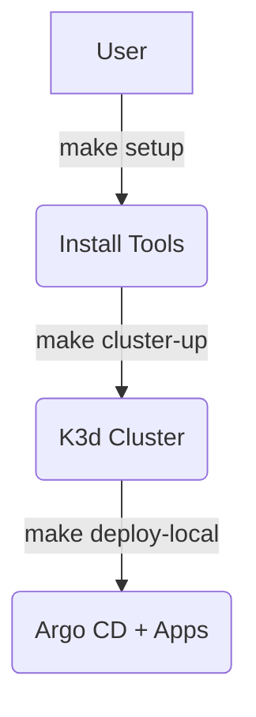
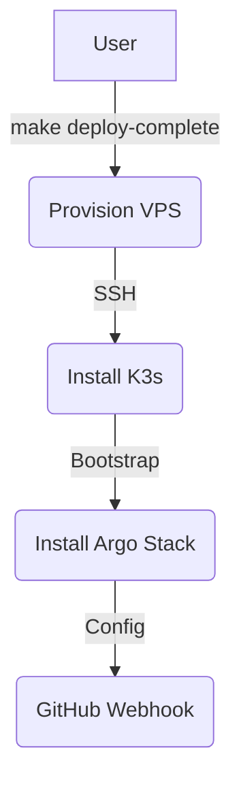
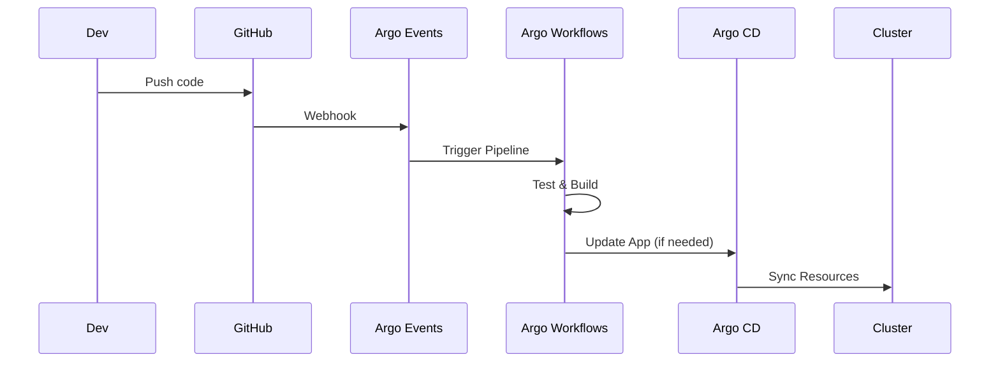
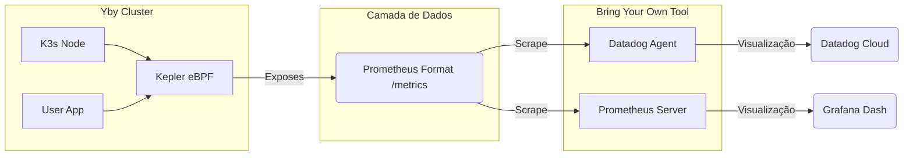

# Diagramas de Fluxo

## 1. Bootstrap Local

```mermaid
graph TD
    A[User] -->|make setup| B(Install Tools)
    B -->|make cluster-up| C(K3d Cluster)
    C -->|make deploy-local| D(Argo CD + Apps)
```

## 2. Deploy Remoto (Zero to Hero)

```mermaid
graph TD
    A[User] -->|make deploy-complete| B(Provision VPS)
    B -->|SSH| C(Install K3s)
    C -->|Bootstrap| D(Install Argo Stack)
    D -->|Config| E(GitHub Webhook)
```

## 3. GitOps Loop

```mermaid
sequenceDiagram
    participant Dev
    participant Git as GitHub
    participant Events as Argo Events
    participant Workflow as Argo Workflows
    participant CD as Argo CD
    participant K8s as Cluster

    Dev->>Git: Push code
    Git->>Events: Webhook
    Events->>Workflow: Trigger Pipeline
    Workflow->>Workflow: Test & Build
    Workflow->>CD: Update App (if needed)
    CD->>K8s: Sync Resources
```

## 4. Fluxo de Observabilidade Ecofuturista

```mermaid
graph LR
    subgraph Cluster [Yby Cluster]
        Node[K3s Node]
        Kepler[Kepler eBPF]
        App[User App]
        
        Node --> Kepler
        App --> Kepler
    end
    
    subgraph DataLayer [Camada de Dados]
        Metrics(Prometheus Format /metrics)
    end
    
    subgraph UserTool [Bring Your Own Tool]
        DD[Datadog Agent]
        Prom[Prometheus Server]
    end
    
    Kepler -->|Exposes| Metrics
    Metrics -->|Scrape| DD
    Metrics -->|Scrape| Prom
    
    DD -->|Visualização| SaaS(Datadog Cloud)
    Prom -->|Visualização| Grafana(Grafana Dash)
```
