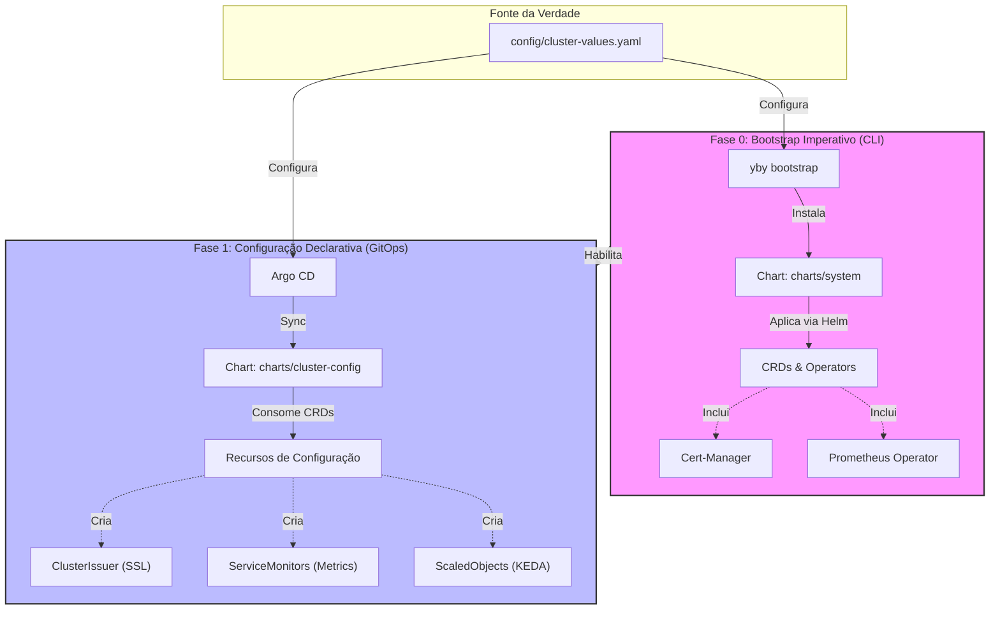

# Arquitetura do Yby: O Padrão Híbrido

Este documento detalha as decisões arquiteturais do projeto Yby, especificamente a estratégia de **Bootstrap Híbrido** (Imperativo + Declarativo) utilizada para resolver problemas clássicos de dependência no Kubernetes.

## O Problema do "Ovo e a Galinha"

No Kubernetes, recursos personalizados (Custom Resources) dependem da existência prévia de suas definições (CRDs). Por exemplo:
- Não é possível criar um `ClusterIssuer` (Recurso) sem antes instalar o Cert-Manager (que provê o CRD `ClusterIssuer`).
- Não é possível criar um `ServiceMonitor` (Recurso) sem antes instalar o Prometheus Operator.

Se tentássemos instalar tudo via GitOps (Argo CD) de uma vez só, o Argo CD falharia ao tentar sincronizar recursos cujos CRDs ainda não existem.

## A Solução: Arquitetura em Duas Fases (Split Brain)

O Yby resolve isso dividindo a infraestrutura em duas camadas distintas, gerenciadas de formas diferentes.



### Detalhamento das Fases

#### Fase 0: Infraestrutura Base (System)
- **Executor:** `yby-cli` (Comando `yby bootstrap cluster`)
- **Método:** Imperativo (`helm install --wait`)
- **Conteúdo (`charts/system`)**:
    - Cert-Manager (Controller + CRDs)
    - Prometheus Operator (Controller + CRDs)
    - Ingress Controllers (se necessário bootstrap prévio)
- **Objetivo:** Preparar o terreno. Garantir que a API do Kubernetes conheça os novos tipos de recursos.

#### Fase 1: Configuração e Glue (Cluster Config)
- **Executor:** Argo CD (GitOps)
- **Método:** Declarativo (Sincronização Contínua)
- **Conteúdo (`charts/cluster-config`)**:
    - `ClusterIssuer` (Configuração do Let's Encrypt)
    - `ServiceMonitors` (Onde buscar métricas)
    - `ScaledObjects` (Regras de escala 0-N)
    - Ingresses e NetworkPolicies globais
- **Objetivo:** Configurar a plataforma usando os CRDs instalados na Fase 0.

## Prevenção de Conflitos

Para evitar que o Argo CD tente reinstalar os CRDs (o que causaria conflito ou erro de "imutable field"), o `charts/cluster-config` possui dependências opcionais configuradas para **NÃO** instalar os componentes base.

No `config/cluster-values.yaml`:

```yaml
kube-prometheus-stack:
  crds:
    enabled: false # CRDs já instalados na Fase 0
  prometheusOperator:
    enabled: false # Operator já instalado na Fase 0
```

Isso garante que o GitOps gerencie apenas a *configuração* (ServiceMonitors, Dashboards), enquanto a CLI garante a *existência* da infraestrutura base.
